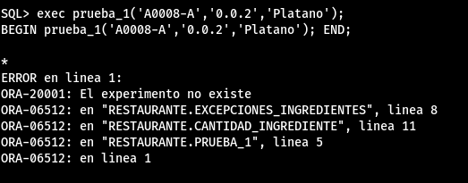
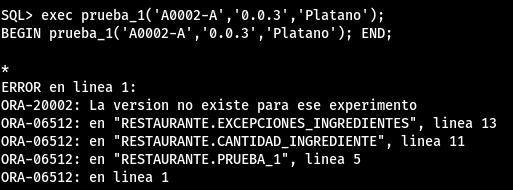
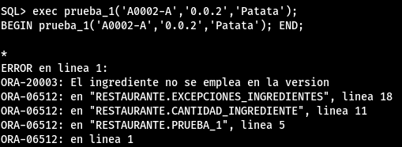

1. Realiza una función que reciba un código de experimento, un código de versión y el nombre de un ingrediente y muestre la cantidad total del ingrediente necesario para una versión. Debes tener en cuenta que el ingrediente puede usarse como base de otros ingredientes preparados y/o directamente en la versión del experimento. Debes contemplar las siguientes excepciones: Experimento inexistente Versión inexistente para ese experimento e Ingrediente no empleado en dicha versión.

```sql
CREATE OR REPLACE FUNCTION cantidad_ingrediente(p_exp Experimentos.Codigo%type, p_ver Versiones.Codigo%type, p_ing Ingredientes.Nombre%type)
return number
is
    v_cantidad number:=0;
    v_total number:=0;
    v_numero_prep number;
    v_numero_ing number;
    v_cod_ing Ingredientes.Codigo%type;
begin
    select codigo into v_cod_ing from ingredientes where nombre=p_ing;
    excepciones_ingredientes(p_exp, p_ver, v_cod_ing);
    select count(*) into v_numero_prep from CompIngredientesPre where CodigoIngredienteBase = v_cod_ing;
    select count(*) into v_numero_ing from IngredientesPorVersion where codigoVersion=p_ver and codigoExperimento=p_exp and codigoIngrediente= v_cod_ing;
    -- comprobamos que el ingrediente es base
    if v_numero_prep > 0 then
        -- si es base de un ingrediente preparado, llamamos a la funcion cantidad_base_prep para que nos devuelva la cantidad de ese ingrediente base que necesitamos para hacer 1 unidad de cada ingrediente preparado que lo contenga
        v_total := v_total+cantidad_base_prep(p_exp, p_ver, v_cod_ing);
    end if;
    -- comprobamos que el ingrediente es directamente empleado en la version
    if v_numero_ing > 0 then
        select sum(cantidad) into v_cantidad from ingredientesporversion where codigoVersion=p_ver and codigoExperimento=p_exp and codigoIngrediente= v_cod_ing;
            v_total := v_total+v_cantidad;
    end if;
    return v_cantidad;
exception
    when no_data_found then
        dbms_output.put_line('No se ha encontrado ningun ingrediente con ese nombre');
        return 0;
end;
/
```

Ahora creo una función que devuelva la cantidad de ingredientes base necesarios para hacer 1 ingrediente preparado:

```sql
CREATE OR REPLACE FUNCTION cantidad_base_prep(p_exp Experimentos.Codigo%type, p_ver Versiones.Codigo%type, p_cod_ing Ingredientes.Codigo%type)
return number
is
    cursor c_preparados is
        SELECT CodigoIngredienteFinal,cantidad
        from CompIngredientesPre
        where CodigoIngredienteBase=p_cod_ing;
    v_total number:=0;
    v_producto number;
begin
    for v_preparado in c_preparados loop
        select cantidad into v_producto from ingredientesporversion where codigoVersion=p_ver and codigoExperimento=p_exp and codigoIngrediente= v_preparado.CodigoIngredienteFinal;
        v_total:= v_total + (v_producto * v_preparado.cantidad);
    end loop;
    return v_total;
end;
/
```

Finalmente, creo un procedimiento para controlar las excepciones:

```sql
create or replace procedure excepciones_ingredientes(p_exp Experimentos.Codigo%type, p_ver Versiones.Codigo%type, p_cod_ing Ingredientes.Codigo%type)
is
    p_numero number;
begin
    -- Excepcion de experimento inexistente
    select count(*) into p_numero from experimentos where codigo=p_exp;
    if p_numero = 0 then
        raise_application_error(-20001,'El experimento no existe');
    end if;
    -- Excepcion de version inexistente para el experimento
    select count(*) into p_numero from versiones where codigo=p_ver and codigoExperimento=p_exp;
    if p_numero = 0 then
        raise_application_error(-20002,'La version no existe para ese experimento');
    end if;
    -- Excepcion de ingrediente no empleado en la version
    select count(*) into p_numero from ingredientesporversion where codigoVersion=p_ver and codigoExperimento=p_exp and codigoIngrediente= p_cod_ing;
    if p_numero=0 then
        raise_application_error(-20003,'El ingrediente no se emplea en la version');
    end if;
end;
/
```

Para comprobar el funcionamiento de la función, creo un procedimiento de prueba:

```sql
create or replace procedure prueba_1(p_exp Experimentos.Codigo%type, p_ver Versiones.Codigo%type, p_ing Ingredientes.Nombre%type)
is
    v_cantidad number;
begin
    v_cantidad := cantidad_ingrediente(p_exp,p_ver,p_ing);
    dbms_output.put_line('Cantidad de '||p_ing||' necesarios: '||v_cantidad);
end;
/

-- ejecucion de ejemplo
exec prueba_1('A0002-A','0.0.2','Platano');
```


También probamos las excepciones:




