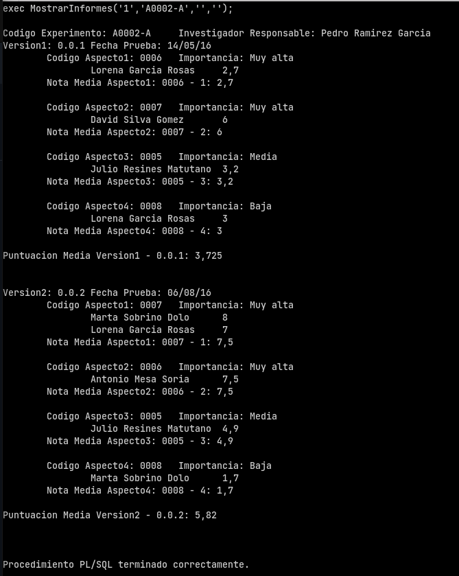
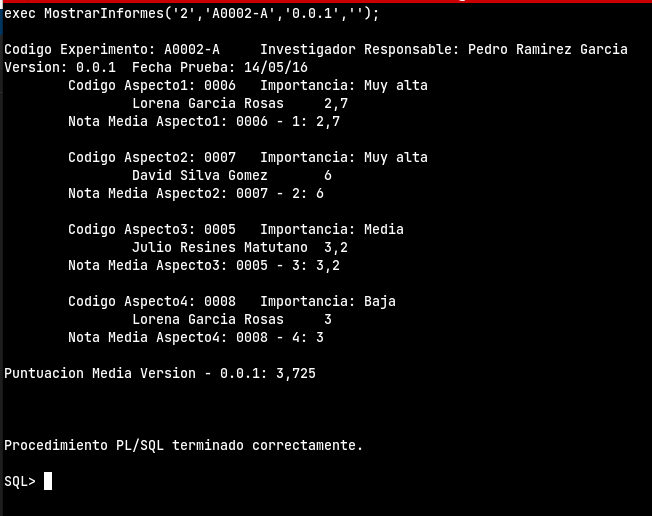
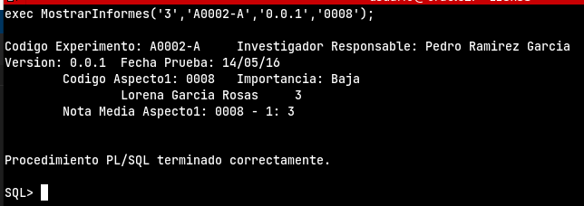

```sql
-- 2. Deseamos realizar, con el menor número posible de consultas a la base de datos, un 
-- procedimiento llamado MostrarInformes que reciba cuatro parámetros. El primero será el tipo de 
-- informe, el segundo un código de experimento y los dos últimos dependerán del tipo de informe.

-- Si el tipo de informe es 1, introducimos valores: Tipo de informe y código del procedimiento, los otros dos, cadenas vacías
-- Si el tipo de informe es 2, introducimos valores: Tipo de informe, código del procedimiento y código de versión
-- Si el tipo de informe es 3, introducimos todos los valores: Tipo de informe, Código del procedimiento, código de versión y código de aspecto

CREATE OR REPLACE PROCEDURE MostrarInformes (p_tipoinforme NUMBER, p_codigoexperimento experimentos.codigo%TYPE, p_codversion versiones.codigo%TYPE, p_codaspecto aspectos.codigo%TYPE)
IS
BEGIN
    IF p_tipoinforme = 1 THEN
        informe1(p_codigoexperimento);
    ELSIF p_tipoinforme = 2 THEN
        informe2(p_codigoexperimento,p_codversion);
    ELSIF p_tipoinforme = 3 THEN
        informe3(p_codigoexperimento,p_codversion,p_codaspecto);
    end if;
END;
/

-- INFORMES
-- Para el orden de importancia, creamos una tabla auxiliar con el nombre de cada importancia y un número 
CREATE TABLE importancias (
    codigo varchar2(4),
    importancia varchar(20),
    numero  number(10),
    CONSTRAINT ck_importancias foreign key (codigo) references aspectos (codigo)
);

INSERT INTO importancias VALUES ('0001','Muy alta','1');
INSERT INTO importancias VALUES ('0002','Alta','2');
INSERT INTO importancias VALUES ('0003','Alta','2');
INSERT INTO importancias VALUES ('0004','Media','3');
INSERT INTO importancias VALUES ('0005','Media','3');
INSERT INTO importancias VALUES ('0006','Muy alta','1');
INSERT INTO importancias VALUES ('0007','Muy alta','1');
INSERT INTO importancias VALUES ('0008','Baja','4');

------------------------------------------------------
-- INFORME 1
-- Creamos el procedimiento principal del tipo de informe 1
CREATE OR REPLACE PROCEDURE informe1 (p_codigoexperimento experimentos.codigo%TYPE)
IS
    cursor c_investigadores is SELECT nombre,apellidos FROM investigadores WHERE nif IN (SELECT nifinvestigador FROM experimentos WHERE codigo = p_codigoexperimento);
BEGIN
    for var in c_investigadores LOOP
        dbms_output.put_line(chr(10)||'Codigo Experimento: '||p_codigoexperimento||chr(9)||'Investigador Responsable: '||var.nombre||' '||var.apellidos);
        versionfecha(p_codigoexperimento);
    end loop;
END;
/

-- Creamos un procedimiento que nos saque la versión y la fecha de prueba de cada experimento en función del experimento que estemos listando en ese momento
CREATE OR REPLACE PROCEDURE versionfecha (p_codigoexperimento experimentos.codigo%TYPE)
IS
    cursor c_versionfecha is SELECT codigo,fechaprueba FROM versiones WHERE codigoexperimento = p_codigoexperimento ORDER BY fechaprueba;
    v_contversion number:=0;
BEGIN
    for var in c_versionfecha loop
        v_contversion := v_contversion+1;
        dbms_output.put_line('Version'||v_contversion||': '||var.codigo||chr(9)||'Fecha Prueba: '||var.fechaprueba);
        aspectoimportancia(p_codigoexperimento,var.codigo);
        dbms_output.put_line('Puntuacion Media Version'||v_contversion||' - '||var.codigo||': '||mediaversion(p_codigoexperimento,var.codigo)||chr(10)||chr(10));
    end loop;
END;
/

-- Creamos un procedimiento que nos saque el código de aspecto junto con su importancia indicando el experimento y su versión
CREATE OR REPLACE PROCEDURE aspectoimportancia(p_codigoexperimento experimentos.codigo%TYPE,p_codigoversion versiones.codigo%TYPE)
IS
    cursor c_aspectoimportancia is SELECT codigo,importancia FROM importancias WHERE codigo IN (SELECT codigoaspecto FROM puntuaciones WHERE codigoexperimento=p_codigoexperimento AND codigoversion = p_codigoversion) ORDER BY numero asc;
    v_contaspecto number:=0;
BEGIN
    for var in c_aspectoimportancia loop
        v_contaspecto := v_contaspecto+1;
        dbms_output.put_line(chr(9)||'Codigo Aspecto'||v_contaspecto||': '||var.codigo||chr(9)||'Importancia: '||var.importancia);
        catadorpuntuacion(p_codigoexperimento,p_codigoversion,var.codigo);
        dbms_output.put_line(chr(9)||'Nota Media Aspecto'||v_contaspecto||': '||var.codigo||' - '||v_contaspecto||': '||mediaaspecto(p_codigoexperimento,var.codigo,p_codigoversion)||chr(10));
    end loop;
END;
/

-- Creamos un procedimiento que nos saque los catadores y la puntuación que ha dado cada catador a cada aspecto de cada versión de cada experimento
CREATE OR REPLACE PROCEDURE catadorpuntuacion (p_codigoexperimento experimentos.codigo%TYPE,p_codigoversion versiones.codigo%TYPE,p_codigoaspecto aspectos.codigo%TYPE)
IS
    cursor c_catadores is SELECT nombre,apellidos,valor FROM catadores,puntuaciones WHERE catadores.nif = puntuaciones.nifcatador AND puntuaciones.codigoexperimento = p_codigoexperimento AND puntuaciones.codigoaspecto = p_codigoaspecto AND puntuaciones.codigoversion = p_codigoversion ORDER BY valor desc;
BEGIN
    for var in c_catadores LOOP
        dbms_output.put_line(chr(9)||chr(9)||var.nombre||' '||var.apellidos||chr(9)||var.valor);
    end loop;
END;
/

-- Creamos un procedimiento que nos calcule la media de cada aspecto
CREATE OR REPLACE FUNCTION mediaaspecto (p_codigoexperimento experimentos.codigo%TYPE,p_codigoaspecto aspectos.codigo%TYPE,p_codigoversion versiones.codigo%TYPE)
RETURN NUMBER
IS
    cursor c_calaspectos is select valor from puntuaciones where codigoexperimento = p_codigoexperimento AND codigoaspecto = p_codigoaspecto AND codigoversion = p_codigoversion;
    v_contador number:=0;
    v_sumavalores number:=0;
    v_total number:=0;
BEGIN
    for var in c_calaspectos LOOP
        v_contador:=v_contador+1;
        v_sumavalores:=v_sumavalores+var.valor;
    end loop;
    v_total:=v_sumavalores/v_contador;
    return v_total;
END;
/

-- Creamos un procedimiento que nos calcule la media de cada versión
CREATE OR REPLACE FUNCTION mediaversion(p_codigoexperimento experimentos.codigo%TYPE,p_codigoversion versiones.codigo%TYPE)
RETURN NUMBER
IS
    cursor c_calversiones is SELECT valor FROM puntuaciones WHERE codigoexperimento = p_codigoexperimento AND codigoversion = p_codigoversion;
    v_contador number:=0;
    v_sumavalores number:=0;
    v_total number:=0;
BEGIN
    for var in c_calversiones LOOP
        v_contador:=v_contador+1;
        v_sumavalores:=v_sumavalores+var.valor;
    end loop;
    v_total:=v_sumavalores/v_contador;
    return v_total;
END;
/
------------------------------------------------------
-- INFORME 2
-- Creamos el procedimiento principal del tipo de informe 2
CREATE OR REPLACE PROCEDURE informe2 (p_codigoexperimento experimentos.codigo%TYPE, p_codversion versiones.codigo%TYPE)
IS
    cursor c_investigadores is SELECT nombre,apellidos FROM investigadores WHERE nif IN (SELECT nifinvestigador FROM experimentos WHERE codigo = p_codigoexperimento);
BEGIN
    for var in c_investigadores LOOP
        dbms_output.put_line(chr(10)||'Codigo Experimento: '||p_codigoexperimento||chr(9)||'Investigador Responsable: '||var.nombre||' '||var.apellidos);
        versionfecha2(p_codigoexperimento,p_codversion);
    end loop;
END;
/

-- Creamos un procedimiento para obtener datos acerca de una versión en función de una versión y un experimento que indicamos como parámetro de entrada (mismo procedimiento que en el informe de tipo 1 pero adaptado para que funcione con lo necesario para el informe de tipo 2)
CREATE OR REPLACE PROCEDURE versionfecha2 (p_codigoexperimento experimentos.codigo%TYPE, p_codversion versiones.codigo%TYPE)
IS
    cursor c_versionfecha is SELECT codigo,fechaprueba FROM versiones WHERE codigoexperimento = p_codigoexperimento AND codigo = p_codversion ORDER BY fechaprueba;
BEGIN
    for var in c_versionfecha loop
        dbms_output.put_line('Version: '||var.codigo||chr(9)||'Fecha Prueba: '||var.fechaprueba);
        aspectoimportancia(p_codigoexperimento,var.codigo);
        dbms_output.put_line('Puntuacion Media Version - '||var.codigo||': '||mediaversion(p_codigoexperimento,var.codigo)||chr(10)||chr(10));
    end loop;
END;
/
------------------------------------------------------
-- INFORME 3
-- Creamos el procedimiento principal del tipo de informe 3
CREATE OR REPLACE PROCEDURE informe3 (p_codigoexperimento experimentos.codigo%TYPE, p_codversion versiones.codigo%TYPE, p_codaspecto aspectos.codigo%TYPE)
IS
    cursor c_investigadores is SELECT nombre,apellidos FROM investigadores WHERE nif IN (SELECT nifinvestigador FROM experimentos WHERE codigo = p_codigoexperimento);
BEGIN
    for var in c_investigadores LOOP
        dbms_output.put_line(chr(10)||'Codigo Experimento: '||p_codigoexperimento||chr(9)||'Investigador Responsable: '||var.nombre||' '||var.apellidos);
        versionfecha3(p_codigoexperimento,p_codversion, p_codaspecto);
    end loop;
END;
/

-- Creamos un procedimiento para obtener datos acerca de una versión en función de una versión, un aspecto y un experimento que indicamos como parámetro de entrada (mismo procedimiento que en el informe de tipo 1 pero adaptado para que funcione con lo necesario para el informe de tipo 3)
CREATE OR REPLACE PROCEDURE versionfecha3 (p_codigoexperimento experimentos.codigo%TYPE, p_codversion versiones.codigo%TYPE, p_codaspecto aspectos.codigo%TYPE)
IS
    cursor c_versionfecha is SELECT codigo,fechaprueba FROM versiones WHERE codigoexperimento = p_codigoexperimento AND codigo = p_codversion ORDER BY fechaprueba;
BEGIN
    for var in c_versionfecha loop
        dbms_output.put_line('Version: '||var.codigo||chr(9)||'Fecha Prueba: '||var.fechaprueba);
        aspectoimportancia3(p_codigoexperimento,var.codigo,p_codaspecto);
    end loop;
END;
/

-- Creamos un procedimiento para obtener datos acerca de un aspecto en función de una versión, un aspecto y un experimento que indicamos como parámetro de entrada (mismo procedimiento que en el informe de tipo 1 pero adaptado para que funcione con lo necesario para el informe de tipo 3)
CREATE OR REPLACE PROCEDURE aspectoimportancia3(p_codigoexperimento experimentos.codigo%TYPE, p_codigoversion versiones.codigo%TYPE, p_codaspecto aspectos.codigo%TYPE)
IS
    cursor c_aspectoimportancia is SELECT codigo,importancia FROM aspectos WHERE codigo IN (SELECT codigoaspecto FROM puntuaciones WHERE codigoexperimento=p_codigoexperimento AND codigoversion = p_codigoversion AND codigoaspecto = p_codaspecto);
    v_contaspecto number:=0;
BEGIN
    for var in c_aspectoimportancia loop
        v_contaspecto := v_contaspecto+1;
        dbms_output.put_line(chr(9)||'Codigo Aspecto'||v_contaspecto||': '||var.codigo||chr(9)||'Importancia: '||var.importancia);
        catadorpuntuacion(p_codigoexperimento,p_codigoversion,var.codigo);
        dbms_output.put_line(chr(9)||'Nota Media Aspecto'||v_contaspecto||': '||var.codigo||' - '||v_contaspecto||': '||mediaaspecto(p_codigoexperimento,var.codigo,p_codigoversion)||chr(10));
    end loop;
END;
/
```
Informe de tipo 1


Informe de tipo 2


Informe de tipo 3

