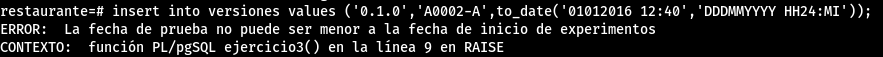

3. Realiza un trigger que impida que se pruebe una versión de un experimento antes de que éste comience o después de que termine.

Programamos el trigger

```sql
CREATE OR REPLACE FUNCTION ejercicio3()
  RETURNS TRIGGER
  LANGUAGE plpgsql
AS
$$
DECLARE
  l_fechainicio experimentos.fechainicio%type;
  l_fechafin experimentos.fechafin%type;
BEGIN
  SELECT fechainicio INTO l_fechainicio FROM Experimentos WHERE codigo = NEW.codigoexperimento;
  SELECT fechafin INTO l_fechafin FROM Experimentos WHERE codigo = NEW.codigoexperimento;
  IF NEW.fechaprueba < l_fechainicio THEN
    RAISE EXCEPTION 'La fecha de prueba no puede ser menor a la fecha de inicio de experimentos';
  END IF;
  IF NEW.fechaprueba > l_fechafin THEN
    RAISE EXCEPTION 'La fecha de prueba no puede ser mayor a la fecha de fin de experimentos';
  END IF;
  RETURN NEW;
END;
$$;
```
definimos la tabla sobre la que actuara el trigger

```sql
CREATE TRIGGER ejercicio3
  BEFORE INSERT OR UPDATE
  ON Versiones
  FOR EACH ROW
  EXECUTE PROCEDURE ejercicio3();
```

Comprobación:

```sql
insert into versiones values ('0.1.0','A0002-A',to_date('01012016 12:40','DDDMMYYYY HH24:MI'));
```




