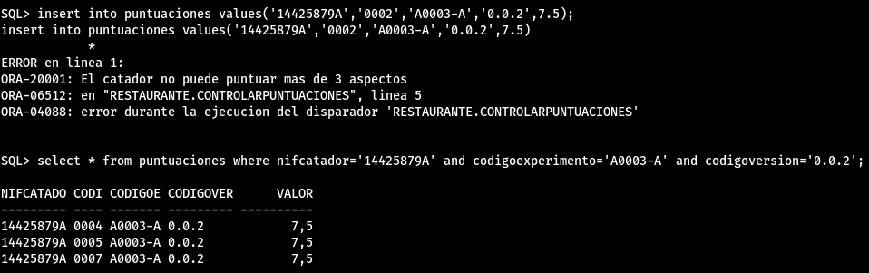

6. Realiza los módulos de programación necesarios para evitar que un catador puntue más de tres aspectos de una misma versión de un experimento.

En este caso, el trigger principal sería sobre la tabla puntuaciones, y dentro, para comprobar que se cumple la condición de que un catador no puntúa más de 3 aspectos, se tendría que hacer una consulta a la misma tabla puntuaciones, que en ese caso estaría mutando. Para resolver el problema vamos a realizar los siguientes pasos:

1. Leer bien los requisitos del problema e identificar la información de la tabla que debo guardar en variables persistentes.
2. Crear el paquete declarando los tipos de datos y las variables necesarias para guardar dicha información.
3. Hacer un trigger before por sentencia que rellene dichas variables consultando la tabla mutante.
4. Hacer un trigger before por fila que compruebe si el registro que se está manejando cumple la condición especificada consultando las variables persistentes.

### 1. Leer bien los requisitos del problema e identificar la información de la tabla que debo guardar en variables persistentes

El contenido de la tabla de puntuaciones es el siguiente:


En este caso, tendríamos que almacenar en variables persistentes los datos de la consulta, que en este caso son los siguientes campos:

* NIFCatador
* CodigoAspecto
* CodigoExperimento
* CodigoVersion

### 2. Crear el paquete declarando los tipos de datos y las variables necesarias para guardar dicha información

```sql
CREATE OR REPLACE PACKAGE ControlPuntuaciones
AS
TYPE tRegistroTablaPuntuaciones IS RECORD --defino el tipo de datos registro
(
NIFCatador Puntuaciones.NIFCatador%TYPE,
CodigoAspecto Puntuaciones.CodigoAspecto%TYPE,
CodigoExperimento Puntuaciones.CodigoExperimento%TYPE,
CodigoVersion Puntuaciones.CodigoVersion%TYPE
);

TYPE tTablasPuntuaciones IS TABLE OF tRegistroTablaPuntuaciones -- defino el tipo de datos tabla
INDEX BY BINARY_INTEGER;
PuntuacionesCatador tTablasPuntuaciones;
-- declaro una variable del tipo tabla antes creado
END ControlPuntuaciones;
/
```

### 3. Hacer un trigger before por sentencia que rellene dichas variables consultando la tabla mutante

En este caso, aparte de lo que se hace en los apuntes, he tenido que añadir una línea para que cuando se inserte un nuevo registro, se añada a la tabla de variables persistente. Aparte, porque daba errores, he añadido al principio del trigger un delete para vaciar la tabla de variables persistentes anteriores (por si se borran datos, ya que daba errores)

```sql
CREATE OR REPLACE TRIGGER RELLENARPUNTUACIONES
BEFORE INSERT OR UPDATE ON Puntuaciones
FOR EACH ROW
DECLARE
CURSOR c_puntuaciones IS SELECT NIFCatador,CodigoAspecto,CodigoExperimento,CodigoVersion
FROM Puntuaciones;
INDICE NUMBER:=0;
indice_u number;
BEGIN

-- vacio el contenido de la tabla
ControlPuntuaciones.PuntuacionesCatador.DELETE;
-- relleno la tabla de puntuaciones los datos que me interesan
FOR v_puntuacion IN c_puntuaciones LOOP
ControlPuntuaciones.PuntuacionesCatador(INDICE).NIFCatador := v_puntuacion.NIFCatador;
ControlPuntuaciones.PuntuacionesCatador(INDICE).CodigoAspecto := v_puntuacion.CodigoAspecto;
ControlPuntuaciones.PuntuacionesCatador(INDICE).CodigoExperimento := v_puntuacion.CodigoExperimento;
ControlPuntuaciones.PuntuacionesCatador(INDICE).CodigoVersion := v_puntuacion.CodigoVersion;
INDICE := INDICE + 1;
END LOOP;
-- si se inserta un nuevo registro, lo añado a la tabla de variables persistentes
if inserting then
indice_u := INDICE;
ControlPuntuaciones.PuntuacionesCatador(indice_u).NIFCatador := :NEW.NIFCatador;
ControlPuntuaciones.PuntuacionesCatador(indice_u).CodigoAspecto := :NEW.CodigoAspecto;
ControlPuntuaciones.PuntuacionesCatador(indice_u).CodigoExperimento := :NEW.CodigoExperimento;
ControlPuntuaciones.PuntuacionesCatador(indice_u).CodigoVersion := :NEW.CodigoVersion;
end if;

END RELLENARPUNTUACIONES;
/
```

### 4. Hacer un trigger before por fila que compruebe si el registro que se está manejando cumple la condición especificada consultando las variables persistentes

En este caso es bastante sencillo, ya que solo tenemos que hacer una consulta a la tabla de variables persistentes y comprobar si el registro que se está manejando cumple la condición especificada. Esta comprobación se hace en una función externa llamada numeroPuntuacionesCatador, que se explica más adelante.

```sql
CREATE OR REPLACE TRIGGER ControlarPuntuaciones
BEFORE INSERT OR UPDATE ON Puntuaciones
FOR EACH ROW
DECLARE
BEGIN
-- compruebo que el catador no haya puntuado más de 3 aspectos
IF (NumeroPuntuacionesCatador(:NEW.NIFCatador,:NEW.CodigoExperimento,:NEW.CodigoVersion) > 3) THEN
RAISE_APPLICATION_ERROR(-20001,'El catador no puede puntuar mas de 3 aspectos');
end if;
END;
/
```

Ahora se  crea  la funcion para comprobar el numero de puntuaciones que tiene un catador en una versión de un experimento:

```sql
CREATE OR REPLACE FUNCTION NumeroPuntuacionesCatador
( p_NIFCatador Puntuaciones.NIFCatador%TYPE, p_CodigoExperimento Puntuaciones.CodigoExperimento%TYPE, p_CodigoVersion Puntuaciones.CodigoVersion%TYPE)
RETURN NUMBER
IS
    v_NumeroPuntuaciones NUMBER:= 0;
BEGIN
    if ControlPuntuaciones.PuntuacionesCatador.FIRST is null then
        return 0;
    else
        for i in ControlPuntuaciones.PuntuacionesCatador.FIRST..ControlPuntuaciones.PuntuacionesCatador.LAST
        LOOP
            if (ControlPuntuaciones.PuntuacionesCatador(i).NIFCatador = p_NIFCatador) and (ControlPuntuaciones.PuntuacionesCatador(i).CodigoExperimento = p_CodigoExperimento) and (ControlPuntuaciones.PuntuacionesCatador(i).CodigoVersion = p_CodigoVersion) then
                v_NumeroPuntuaciones := v_NumeroPuntuaciones + 1;
            end if;
        END LOOP;
    end if;
    return v_NumeroPuntuaciones;
end;
/
```

Una vez finalizado, para comprobar que funciona, se insertan 4 puntuaciones de un mismo catador en una misma versión de un experimento:


```sql
insert into puntuaciones values('14425879A','0004','A0003-A','0.0.2',7.5);
insert into puntuaciones values('14425879A','0005','A0003-A','0.0.2',7.5);
insert into puntuaciones values('14425879A','0006','A0003-A','0.0.2',7.5);
insert into puntuaciones values('14425879A','0007','A0003-A','0.0.2',7.5);
```

