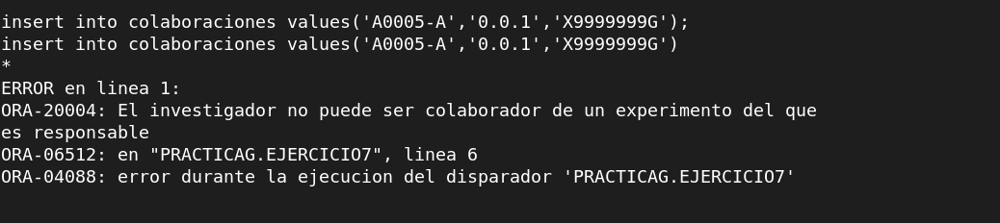

-- 7. Realiza los módulos de programación necesarios para evitar que un investigador figure como 
-- colaborador de un experimento del que es responsable.
```sql
create or replace trigger ejercicio7 before insert or update on Colaboraciones for each row
declare
l_codexp experimentos.codigo%type;
begin
select codigo into l_codexp from Experimentos where nifinvestigador = :new.NIFInvestigador and nifinvestigador in(select :new.nifinvestigador from colaboraciones where :new.codigoexperimento =(select codigo from experimentos where nifinvestigador = :new.nifinvestigador));
    if l_codexp = :new.codigoexperimento then
        raise_application_error(-20004, 'El investigador no puede ser colaborador de un experimento del que es responsable');
    end if;
exception
when no_data_found then
    null;
end ejercicio7;
/
```

Comprobación:


