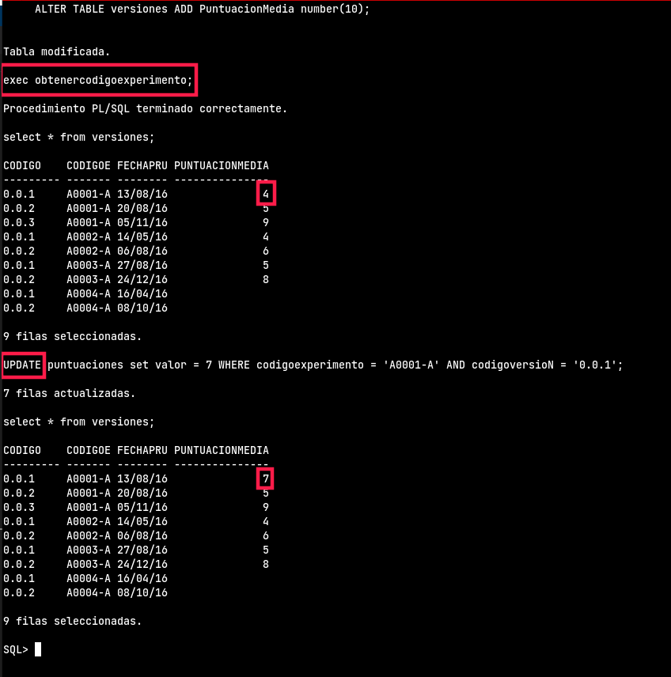

```sql
-- 7. Realiza los módulos de programación necesarios para evitar que un investigador figure como 
-- colaborador de un experimento del que es responsable.

-- Programamos una función que es la que queremos que ejecute el trigger
CREATE FUNCTION funcion_programada()
    RETURNS trigger AS
$BODY$
DECLARE
    l_codexp experimentos.codigo%type;
BEGIN
    select codigo into l_codexp from Experimentos where nifinvestigador = new.NIFInvestigador and nifinvestigador in(select new.nifinvestigador from colaboraciones where new.codigoexperimento =(select codigo from experimentos where nifinvestigador = new.nifinvestigador));
    if l_codexp = new.codigoexperimento then
        raise notice '%', 'El investigador no puede ser colaborador de un experimento del que es responsable';
    end if;
    exception
    when no_data_found then
        null;
END;
$BODY$
LANGUAGE plpgsql;

-- Definimos el trigger en la tabla que queremos que se ejecute
create trigger ejercicio7 
before insert or update 
on colaboraciones 
for each row
    execute procedure funcion_programada();
```

Comprobación:
Primero ejecutamos el procedimiento que añade la puntuacion media de los experimentos a la nueva columna de la tabla versiones y luego probamos actualizando todos los datos de la tabla puntuaciones de un experimento concreto para que su media sea 7, y al listar las puntuaciones medias de la tabla versiones vemos que se ha actualizado automáticamente

